* Note: Array indexing starts from 1 here. (in examples)
* Go through- ./MIT6_006F11_lec04_heaps.pdf
  * heapsort code slide 22
* When you modify a DS, you want to maintain the original invariants
* Priority queue is a set S of elements. Each element is associated with a key. Each entry in the priority queue can now store complex data structure (like age, address etc), instead of a single entry as in array. The key is used for priority/ordering and is also a pointer to actual data structure. What key is to be used depends on the problem
* Heaps are interesting case study of representing trees via arrays. Whenever you think of heap; think of an array, seen a **nearly complete** binary tree. Heap has O(logn) levels because its a balanced binary tree

* max heap- trivial to find max element
* min heap- trivial to find min element
* Imp- there should be only 1 violation when max heapify is called. build_max_heap/heap_sort maintain this invariant
* Heapsort seems to take O(nlogn) even if array is sorted. Recheck/reconfirm
* Think how to perform+implement insert(S,x) and Increase_key(S,x,k) in heaps
```
theta(logn) time. nearly complete binary tree
def max_heapify(A,i):
  l=left(i) #returns left child of i
  r=right(i) #returns right child of i
  if l<=heap_size(A) and A[l]>A[i]:
    largest=l
  else:
    largest=i
  if r<=heap_size(A) and A[r]>A[largest]:
    largest=r
  if (largest!=i):
    swap(A[i],A[largest])
    max_heapify(A,largest)

# heap_size(A)==len(A) as A is an array/list
# l<=heap_size(A) checks if left child exists or not
# r<=heap_size(A) checks if right child exists or not
```

```
def build_max_heap(A):
  for i=n/2 to 1:
    max_heapify(A,i)
# running this makes the array A into heap. That is every node satisfies the heap property

def heap_sort(A):


```

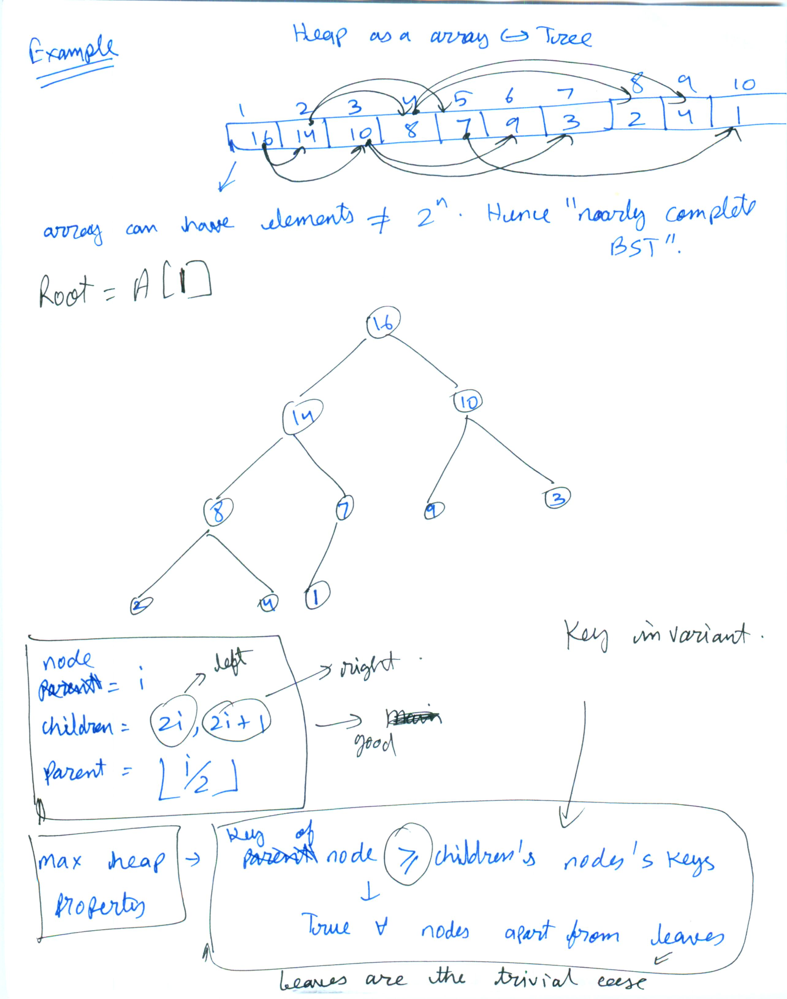
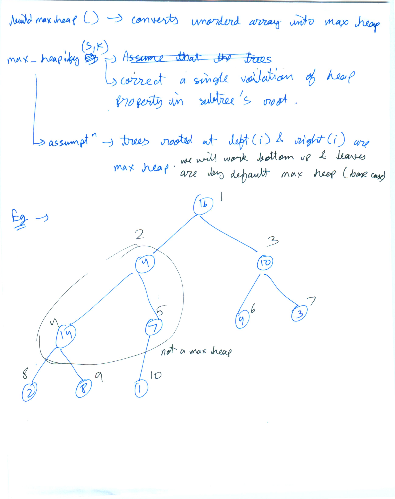


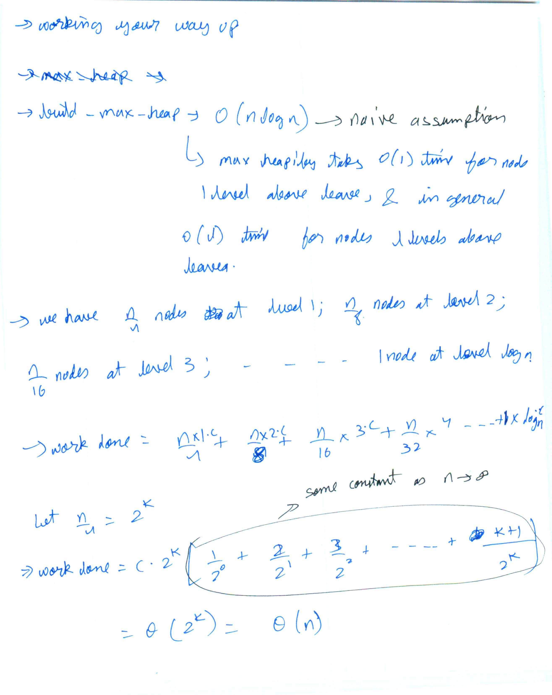

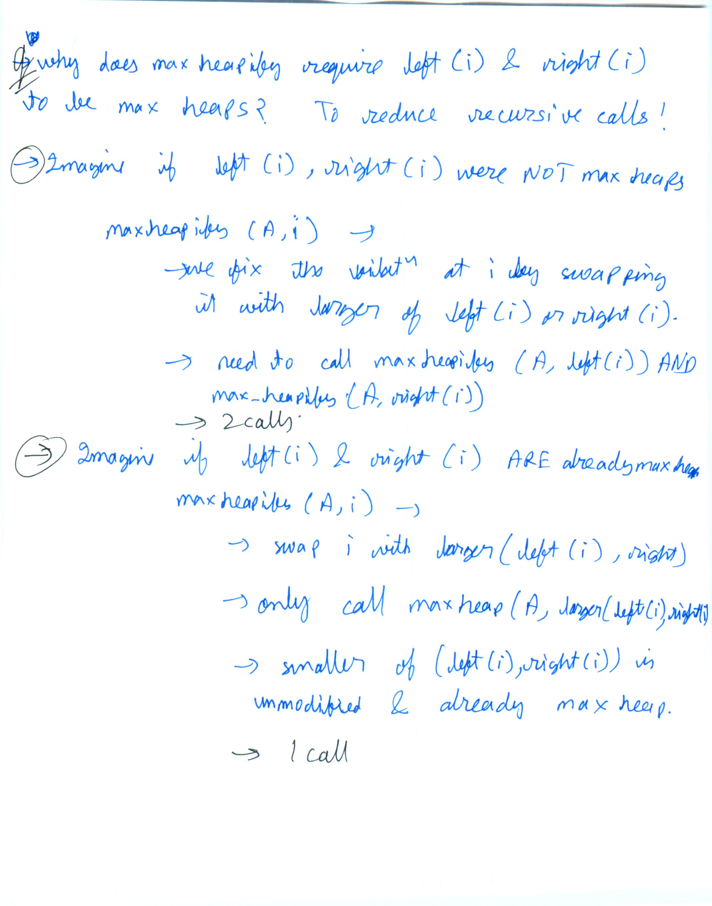
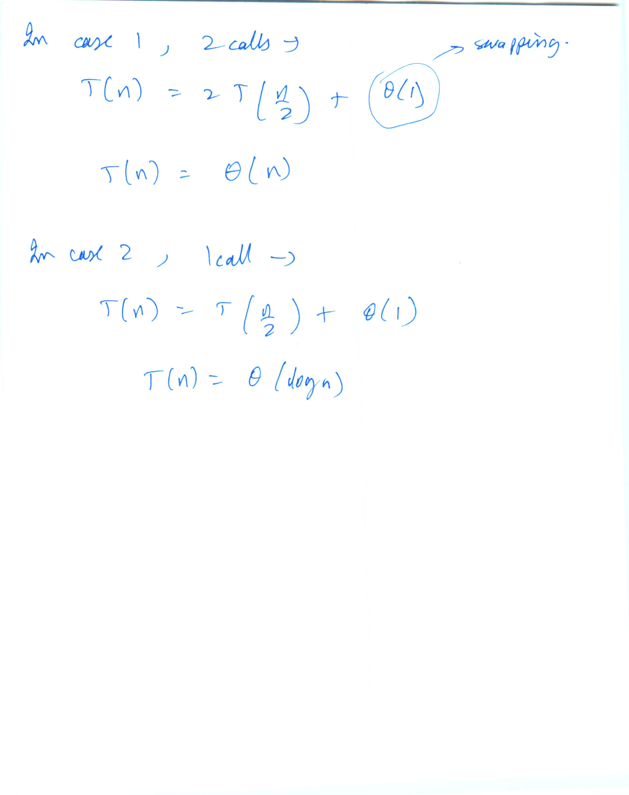

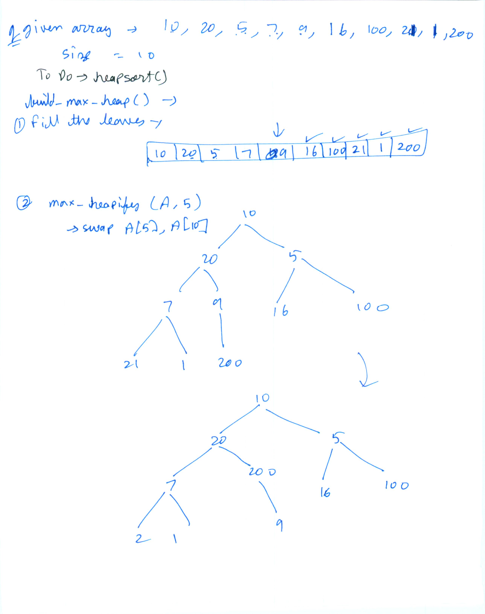
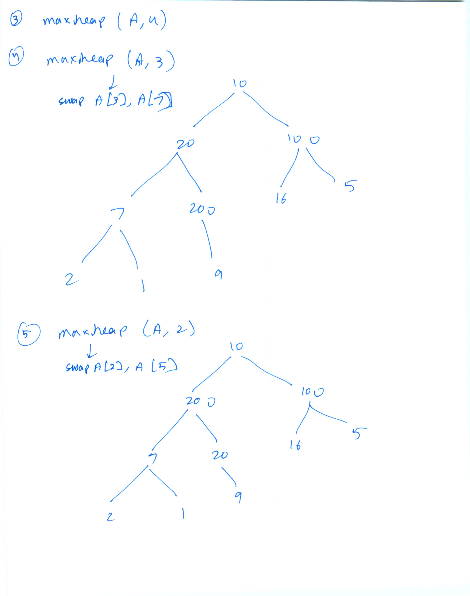
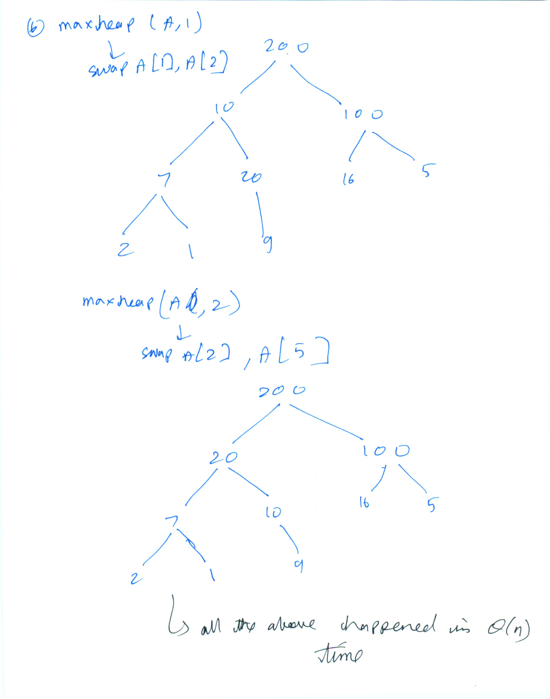
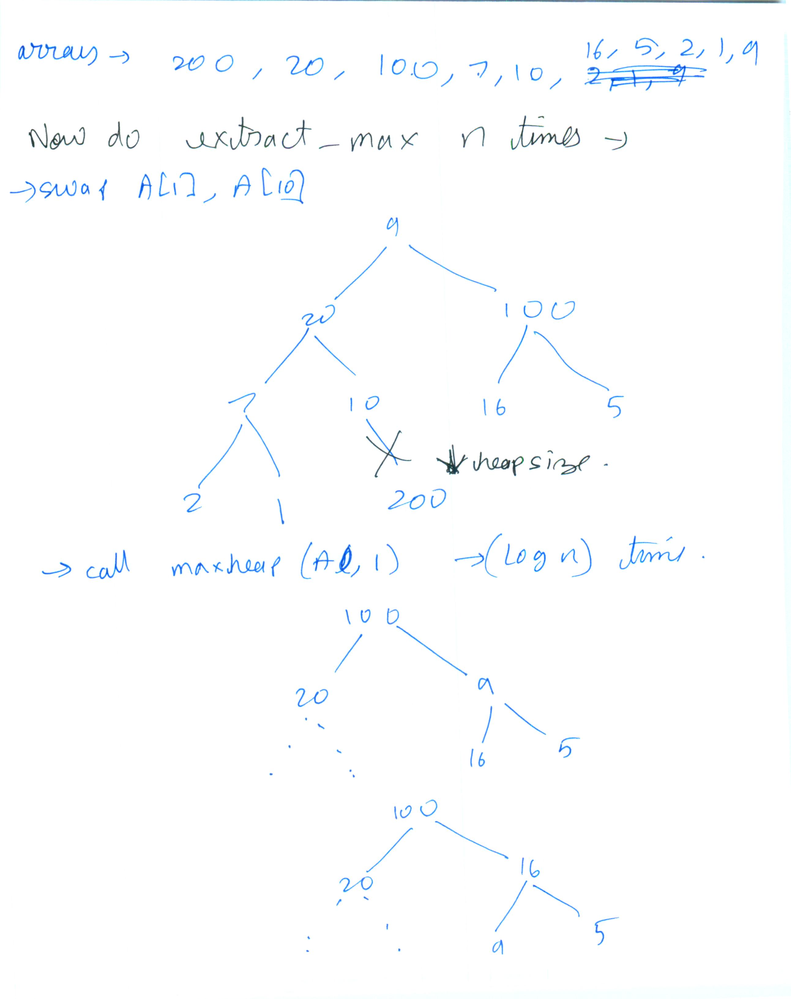

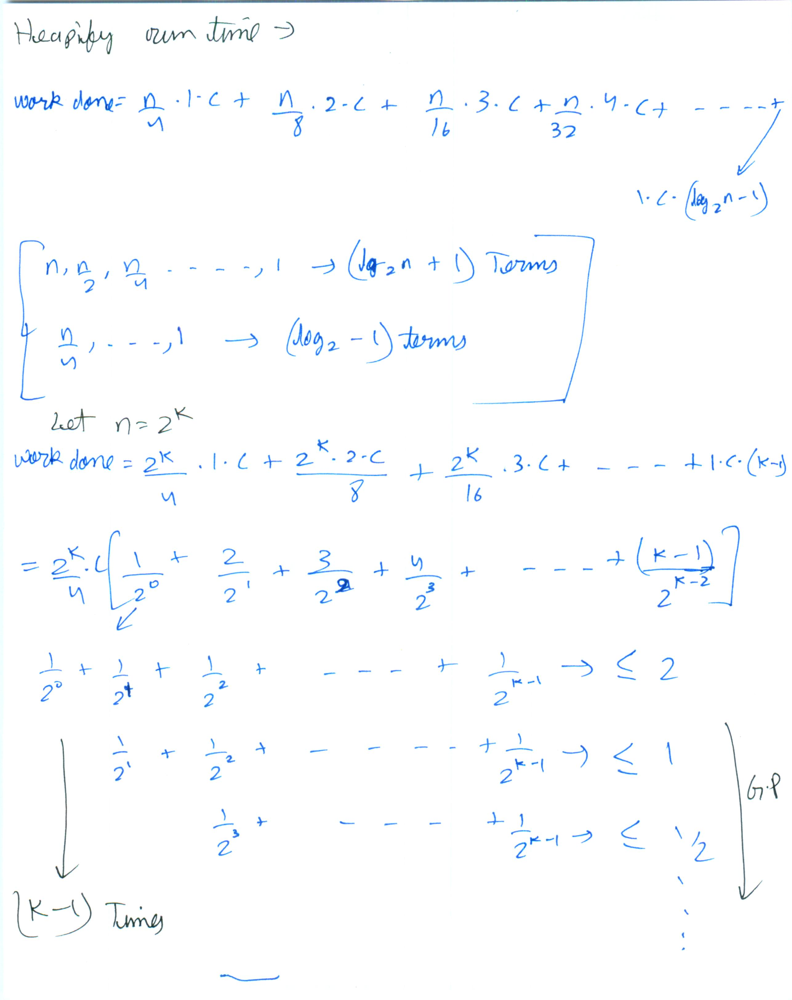
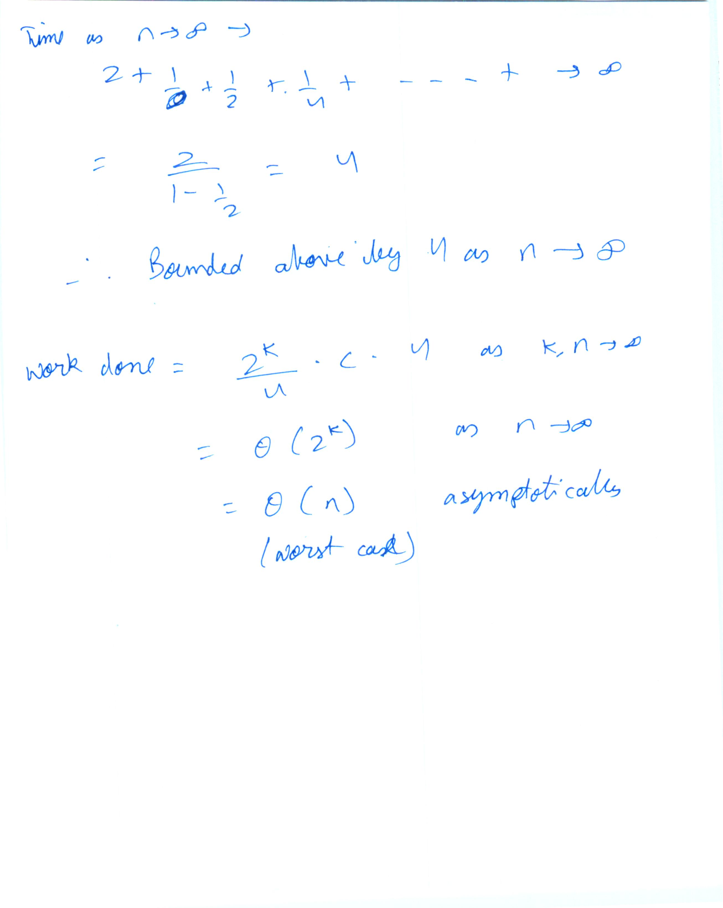
* Go through PDFs 0-2

* DS that supports simultaneous extract min and extract max-
  * "not heap" :)
  * BST might be one of them
* Heapify
  * When you insert into heap, it takes O(log n) time.
  * To initialize a heap of size n, naively it might take O(n* log n) time; if you insert one element at a time.
  * You can use the "heapify" property/trick. Does heap initialization in O(n) time. implemented above as build_max_heap(A)
* Heapsort-
  * Magic- We went from really poor quadratic time of comparison based method (selection sort); to best possible time for any sorting algorithm just by swapping in heap DS.
* Further applications of heap-
  * Event Manager.
    * Can't imagine concretely yet.
    * Yes i do need to repeatedly get the next scheduled event in the simulation.
    * If repeated extract-min gives this output, then yes, heap is good
  * Median maintenance
    * Key : maintain invariant that ~ i/2 smallest in Hlow and rest in Hhigh.
    * As the elements stream in, might want to "balance" the 2 heaps to maintain this invariant
  * Speeding Up Dijkstra
* There could be multiple trees representing the same heap
* To think of it, heap has a very weak invariant. Which is why insertion is so easy*
* When to use heap?
* To Do
  - [ ] Implement heap
  - [ ] Code up median maintenance
