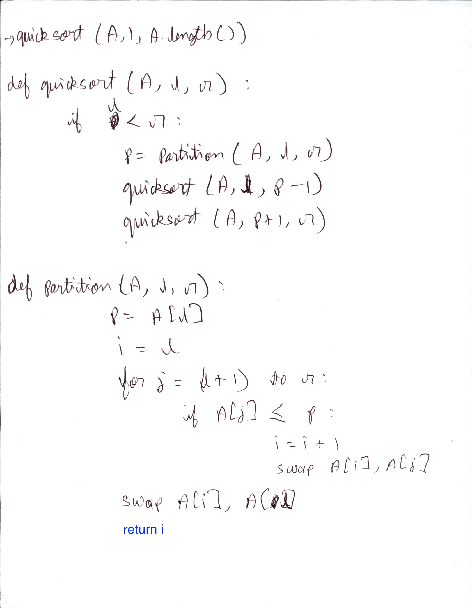
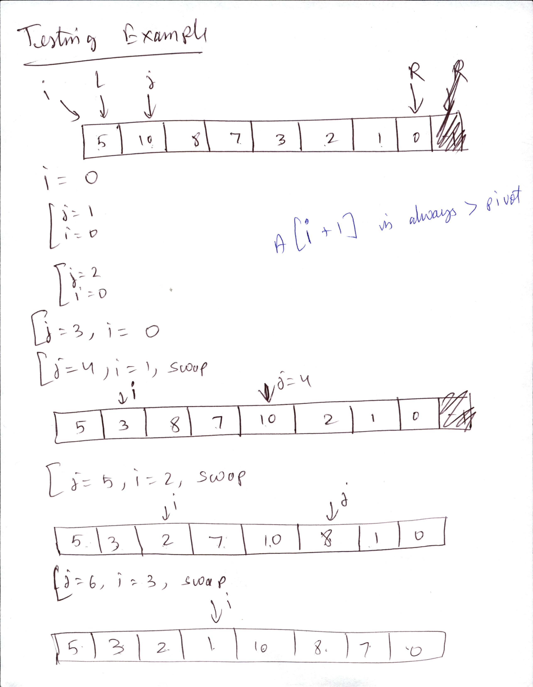
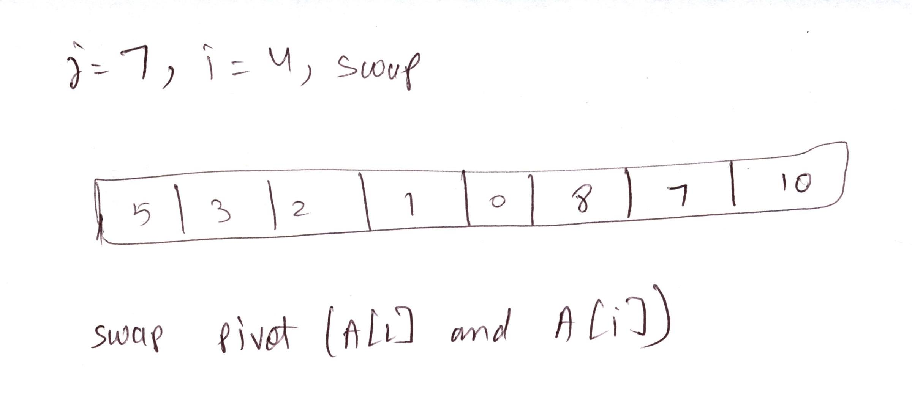
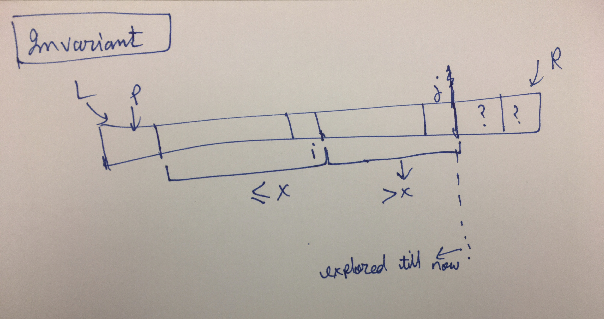

* Loop invariant in quicksort.
  * 
* Quick sort. In place like insertion sort
* Pick 1st element of array as pivot
* Worst case. O(n^2). When pivot is picked smaller than all other elements. Or larger than all other elements
* Happens when input is sorted, or reversely sorted.
* $T(n)=T(n-1)+T(0)+\theta(n)$
* $T(n)=T(n-1)+\theta(1)+\theta(n)$
* Master method doesn't work. Use recursion tree method
* 
* Do best case analysis. This Recurrence same as merge sort
* Randomized quicksort. running time independent of input. Always $O(n*logn)$ on average. No specific input gives us the worst case now. Worst case of $O(n^2)$ can happen randomly. (If you are unlucky with random pivots chosen)
  * Partition is $\theta(n)$ always
  * $T(n)=2T(n/2)+\theta(n)$ (lucky)
  * $T(n)=T(n-1)+T(0)+ \theta(n)$ (unlucky)
  * Average the lucky and unlucky case. Gives O(nlogn). Hand wavy argument. Randomized Do proper analysis
* Claim in ./4_slides_algo-qsort-pivot_typed.pdf -
  * if always get a 25-75 split, good enough for O(nlog(n))
  * Proof of running time with 25-75 split-
  * 
* Randomized quicksort pseudocode- Pick pivot randomly, swap with first element; follow the pseudocode above
* Randomized quicksort analysis-
  * Refer PDF 4_... to 7...
  * 
  * 
