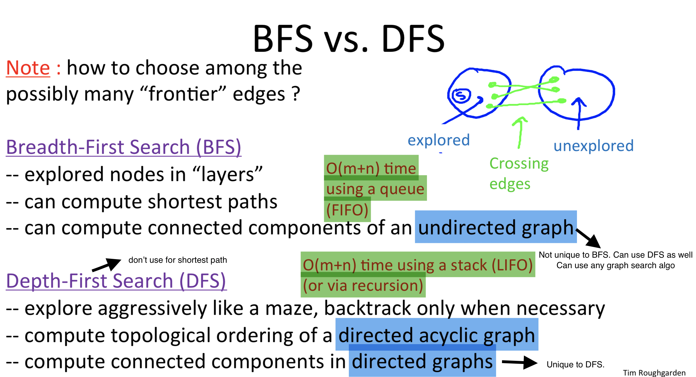

THE HOMEWORK: Problem Set #1 should help you solidify your understanding of graph representations and graph search. The programming assignment asks you to implement the SCC algorithm from the lectures, and report your findings about the SCCs of a large graph. Programming Assignment #1 is the most difficult one of the course (and one of the more difficult ones in the entire specialization); as always, I encourage you to use the discussion forums to exchange ideas, tips, and test cases. If you can get through the first week of the course, it should be all downhill from there!

BFS and DFS are ways to 'explore the graph'

- 'shortest path' task is specific to BFS. (not all graph search algos are capable of finding the shortest path)
- use BFS to find connectivity in undirected graph. Can also use DFS. just replace BFS by DFS
- Use stack instead of queue in BFS code + some modifications and you get code for DFS
- Use DFS to find 'topological ordering' of DAG- specific to DFS
  - DFS is ideal for 'topological ordering' because the recursive call of DFS naturally ends at the greatest topological sort node in a DAG
  - 'topological ordering' has a naive solution and a more elegant solution via DFS
- Use DFS to find 'strongly connected components' of DAG
- Alternate: recursive implementation for DFS- very slick

The culmination of these lectures --- computing the strongly connected components of a directed graph with just two passes of depth-first search --- vividly illustrates the point that fast algorithms often require deep insight into the structure of the problem that you're solving. If you're feeling REALLY motivated, you might read up on Tarjan's earlier algorithm for computing SCCs that needs only a single DFS pass!

https://stackoverflow.com/questions/11212676/what-are-strongly-connected-components-used-for

- A BFS on a binary tree generally requires more memory than a DFS.

https://www.geeksforgeeks.org/applications-of-breadth-first-traversal/

Q1.

Given an adjacency-list representation of a directed graph, where each vertex maintains an array of its outgoing edges (but *not* its incoming edges), how long does it take, in the worst case, to compute the in-degree of a given vertex? As usual, we use n and m to denote the number of vertices and edges, respectively, of the given graph. Also, let k denote the maximum in-degree of a vertex. (Recall that the in-degree of a vertex is the number of edges that enter it.)

A1. θ(m)-> parse through all m elements in the adjacency-list (each elements corresponds to an edge). Without explicitly maintaining a list of incoming edges, you might have to scan all the edges to identify the incoming arcs.

Q2.
Consider the following problem: given an undirected graph G with nnn vertices and mmm edges, and two vertices s and t, does there exist at least one s-t path?
If G is given in its adjacency list representation, then the above problem can be solved in O(m+n)O(m+n)O(m+n) time, using BFS or DFS. (Make sure you see why this is true.)
Suppose instead that G is given in its adjacency *matrix* representation. What running time is required, in the worst case, to solve the computational problem stated above? (Assume that G has no parallel edges.)

A2. <unsolved>
θ(n2)
http://andrew-exercise.blogspot.com/2015/11/algorithms-design-and-analysis-part-1_95.html - lower bound claim not clear

Q3. This problem explores the relationship between two definitions about graph distances. In this problem, we consider only graphs that are undirected and connected. The diameter of a graph is the maximum, over all choices of vertices s and t, of the shortest-path distance between s and t. (Recall the shortest-path distance between s and t is the fewest number of edges in an s-t path.)
Next, for a vertex s, let l(s) denote the maximum, over all vertices t, of the shortest-path distance between s and t. The radius of a graph is the minimum of l(s) over all choices of the vertex s.
Which of the following inequalities always hold (i.e., in every undirected connected graph) for the radius r and the diameter d? [Select all that apply.]

r≥d
r≤d/2
r≥d/2
r≤d

A3. http://andrew-exercise.blogspot.com/2015/11/algorithms-design-and-analysis-part-1_5.html
r≥d/2
r≤d

Q4. Consider our algorithm for computing a topological ordering that is based on depth-first search (i.e., NOT the "straightforward solution"). Suppose we run this algorithm on a graph G that is NOT directed acyclic. Obviously it won't compute a topological order (since none exist). Does it compute an ordering that minimizes the number of edges that go backward?
For example, consider the four-node graph with the six directed edges (s,v),(s,w),(v,w),(v,t),(w,t),(t,s). Suppose the vertices are ordered s,v,w,t. Then there is one backwards arc, the (t,s) arc. No ordering of the vertices has zero backwards arcs, and some have more than one.

A4. Sometimes yes, Sometimes no
http://andrew-exercise.blogspot.com/2015/11/algorithms-design-and-analysis-part-1_30.html

Q5. On adding one extra edge to a directed graph G, the number of strongly connected components...?

...never decreases (no matter what G is)
...will definitely not change (no matter what G is)
...could remain the same (for some graphs G)
...never decreases by more than 1 (no matter what G is)

A5. ...could remain the same (for some graphs G)
Can decease by more than 1. For eg-

Programming Ques.
The file contains the edges of a directed graph. Vertices are labeled as positive integers from 1 to 875714. Every row indicates an edge, the vertex label in first column is the tail and the vertex label in second column is the head (recall the graph is directed, and the edges are directed from the first column vertex to the second column vertex). So for example, the 11th11^{th}11th row looks liks : "2 47646". This just means that the vertex with label 2 has an outgoing edge to the vertex with label 47646

Your task is to code up the algorithm from the video lectures for computing strongly connected components (SCCs), and to run this algorithm on the given graph.

Output Format: You should output the sizes of the 5 largest SCCs in the given graph, in decreasing order of sizes, separated by commas (avoid any spaces). So if your algorithm computes the sizes of the five largest SCCs to be 500, 400, 300, 200 and 100, then your answer should be "500,400,300,200,100" (without the quotes). If your algorithm finds less than 5 SCCs, then write 0 for the remaining terms. Thus, if your algorithm computes only 3 SCCs whose sizes are 400, 300, and 100, then your answer should be "400,300,100,0,0" (without the quotes). (Note also that your answer should not have any spaces in it.)

WARNING: This is the most challenging programming assignment of the course. Because of the size of the graph you may have to manage memory carefully. The best way to do this depends on your programming language and environment, and we strongly suggest that you exchange tips for doing this on the discussion forums.
