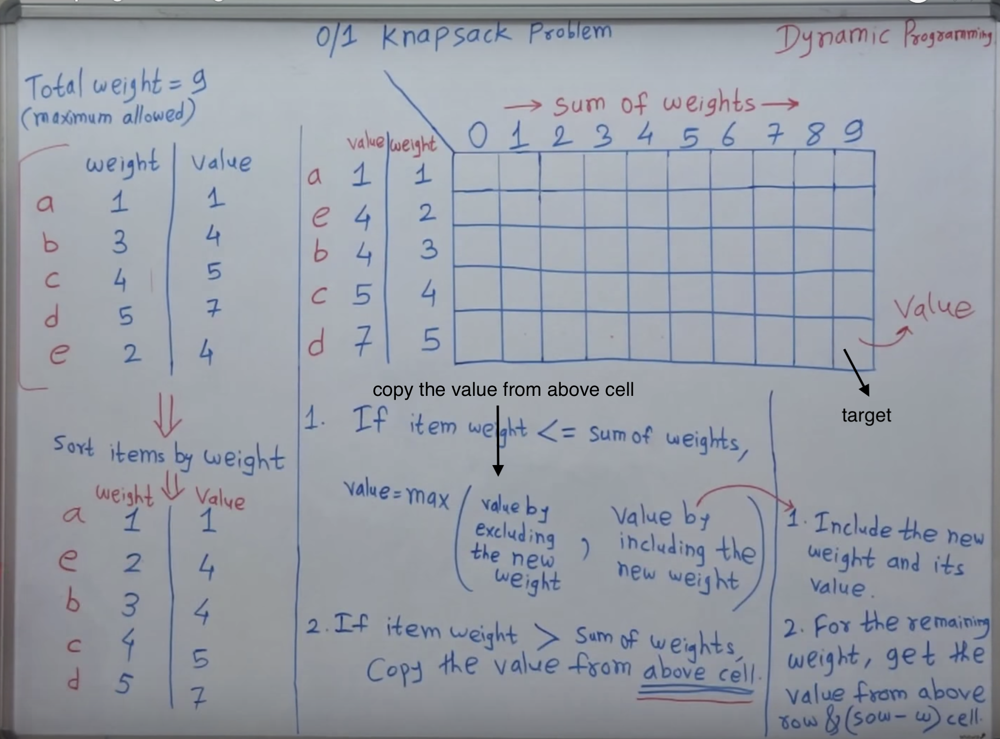
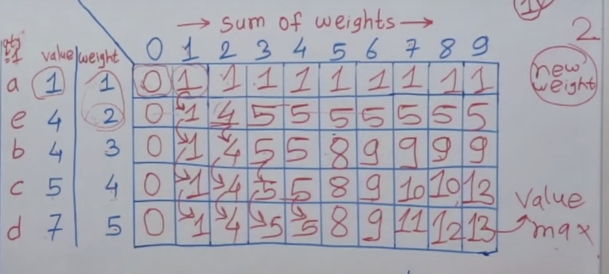
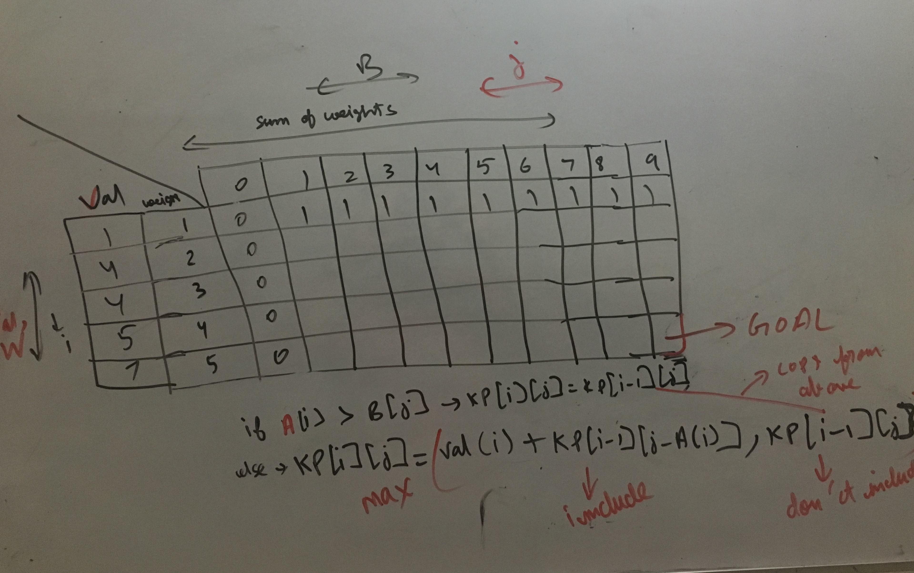

1. Naive exponential solution (Backtracking)

0/1 knapsack
Means you either pick the item, or you don't. Can pick the item partially
If items could have been split, use greedy algorithm->
Sort the items by their value/weight ratio, and keep picking the max value/weight items, till your weight is reached. (last item would be partially picked)

Whenever a new item comes in, decide whether to pick it, or not.

We only have 1 quantity of each type of item

Get max total value

Let's say KP represents the above table. Iterator for X axis/columns (sum of weights) is j and iterator for weights (rows) is i. sum of weights is an array stored in B (X axis) and individual weights are store in A (Y axis). A is sorted by weights, and the value array Val has a 1-1 correspondence with A (ensure this). Below image clears this-

subproblem-
KP[i][j] represents max value possible in this configuration. "i" represents weights upto ith weight (weights are in sorted order). j represents total weight allowed in this config

Goal is fill the table and answer is KP[-1][-1]. (very last entry of matrix). That represents the problem.

Algorithm- In pic3.jpg

retracing to find the solution

bottoms up - sol1.py
DP recursive- sol2.py

and Recursive

recursive-
- CS dojo, geek4geek
- recursive DP should seem just like Backtracking with small changes

else- bottoms up

Bottoms up source-
https://www.youtube.com/watch?v=8LusJS5-AGo
https://www.youtube.com/watch?v=sVAB0p58tlg

Print all knapsack solutions (there might be more than 1)

Python knapsack top down
https://www.sanfoundry.com/python-program-solve-0-1-knapsack-problem-using-dynamic-programming-memoization/

Excellent
https://codereview.stackexchange.com/questions/20569/dynamic-programming-knapsack-solution

Understand the subproblems. And how those subproblems relate to answer the original problem

Complexities

n = total items    
m = max weight (max weight constraint)     

Time: O(nm) (we will be solving this many subproblems)     
Space: O(nm) (we will store the results of n*m subproblems)

Future-
1. Second method to solve knapsack- "sets method"
https://www.youtube.com/watch?v=nLmhmB6NzcM
