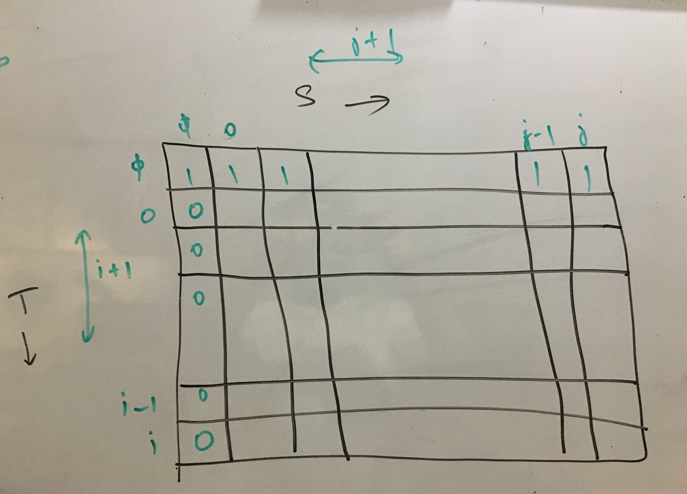
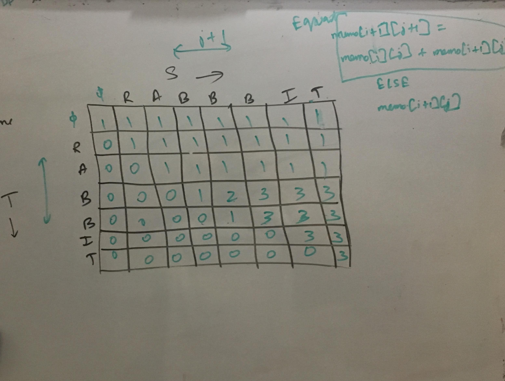
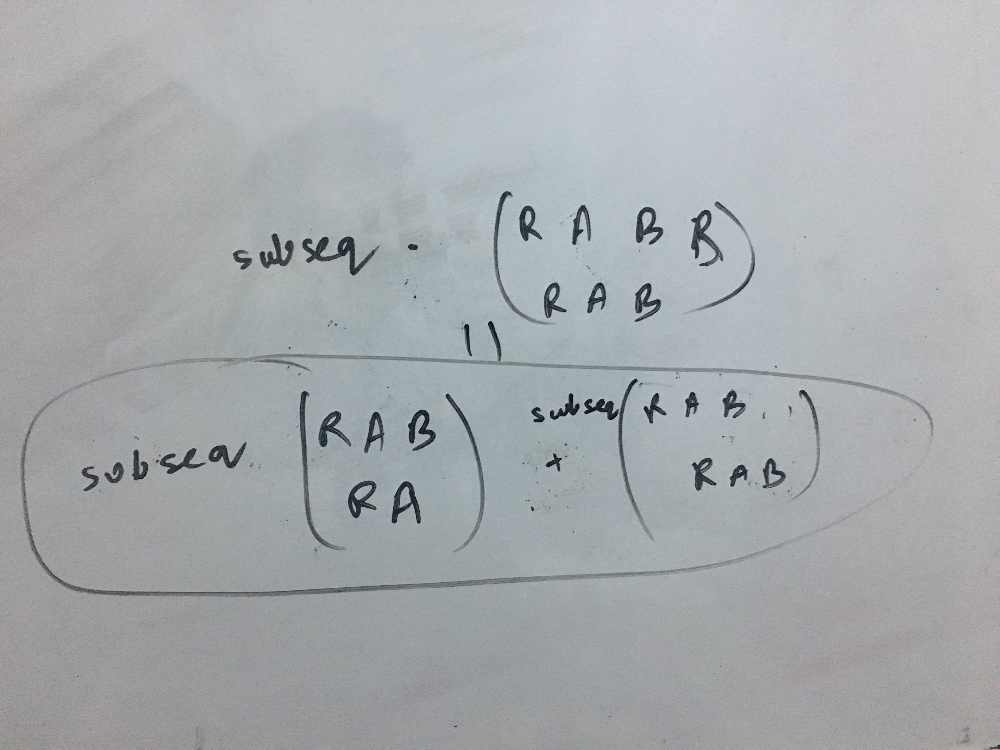

Nothing new in below link. Don't open
https://www.geeksforgeeks.org/count-distinct-occurrences-as-a-subsequence/

Time Complexity : O(m\*n)   
Auxiliary Space : O(m\*n)

Future:
Do in O(n) space
https://leetcode.com/problems/distinct-subsequences/discuss/37412/Any-better-solution-that-takes-less-than-O(n2)-space-while-in-O(n2)-time

https://leetcode.com/problems/distinct-subsequences/discuss/37316/7-10-lines-C%2B%2B-Solutions-with-Detailed-Explanations-(O(m*n)-time-and-O(m)-space)

https://stackoverflow.com/questions/20459262/distinct-subsequences-dp-explanation

http://www.cs.cmu.edu/~yandongl/distinctseq.html

https://leetcode.com/problems/distinct-subsequences/discuss/37322/Python-dp-solutions-(O(m*n)-O(n)-space).

Similar to "edit distance"/ "Ways of Coin Changes" problems
