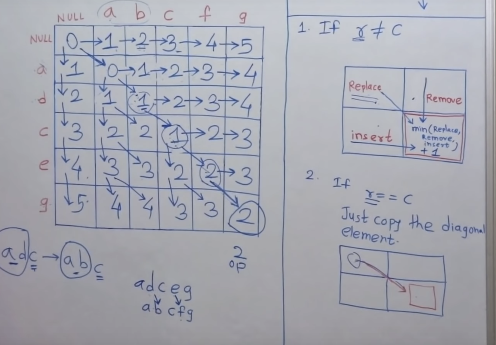
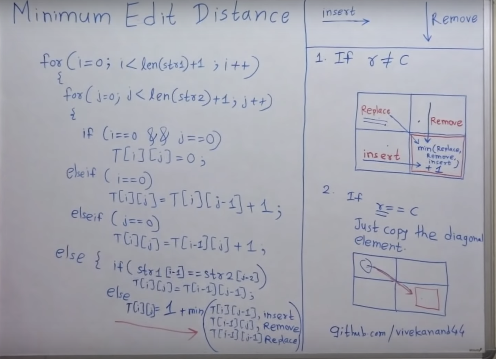
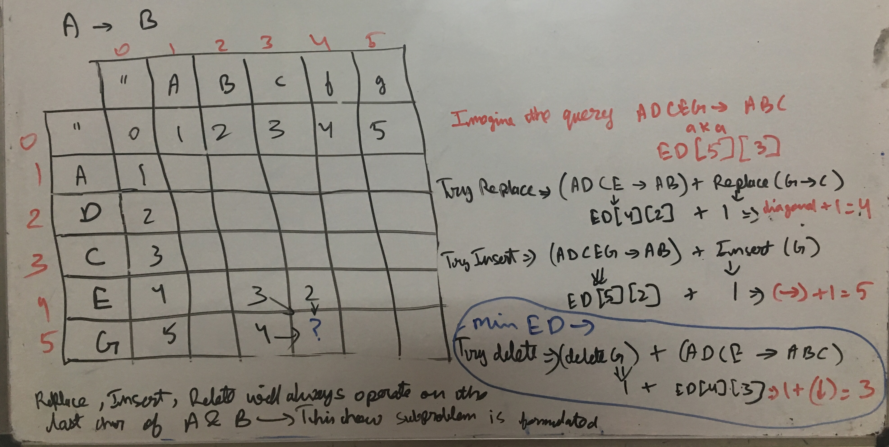

Spelling correction; (how similar is typed word to all words in dictionary, and then predict the most likely one)    
DNA sequence (some mutations are more common than others)    
Longest common subsequence. Can be modeled as an edit distance problem

Null string is appended at start of both A and B. So A=""+A_org. And B=""+B_org     
len(A)=1+len(A_org)    
len(B)=1+len(B_org)    

Based on image below, we are converting string on Y axis (A) to string on X axis (B). (just a convention)

ED[i][j] represents min edits needed to convert A[:i] to B[:j]

How the formula? This is how->

Once DP table is made, it can be retraced to get what substitutions were made

* Min edit distance is symmetric.
To make string A->B, we might do replace, insert, delete. To make string B->A, we will do exactly same replace, delete, and insert (delete becomes and insert and insert becomes delete). In table, it represents switching X and Y axis. (If string A was on X axis, its now on Y axis. And string B goes from Y axis to X axis)

sol1.py- bottom up
sol2.py- brute force recursion
sol3.py- brute force recursion 2
sol4.py- top down

Top Down-
Suffix problem
DP(i,j)=edit distance between A[i:] and B[j:]

Great answers-
https://leetcode.com/problems/edit-distance/discuss/159295/Python-solutions-and-intuition
https://leetcode.com/problems/edit-distance/discuss/25895/Step-by-step-explanation-of-how-to-optimize-the-solution-from-simple-recursion-to-DP

Future-

1. O(n) space solution-
https://leetcode.com/problems/edit-distance/discuss/25846/C%2B%2B-O(n)-space-DP

2. Write in C++

3. Brute force method running time

4. Retrace to get what substitutions were made. For both top down and bottom up
https://github.com/mission-peace/interview/blob/master/src/com/interview/dynamic/EditDistance.java
