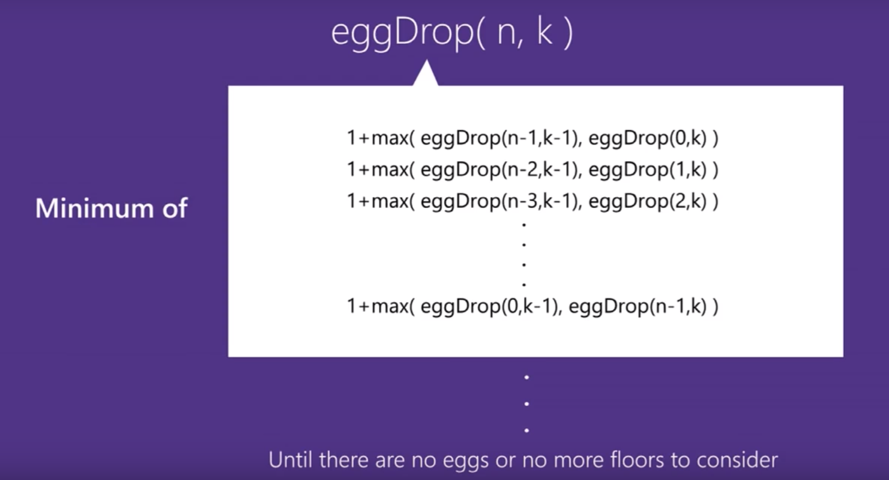
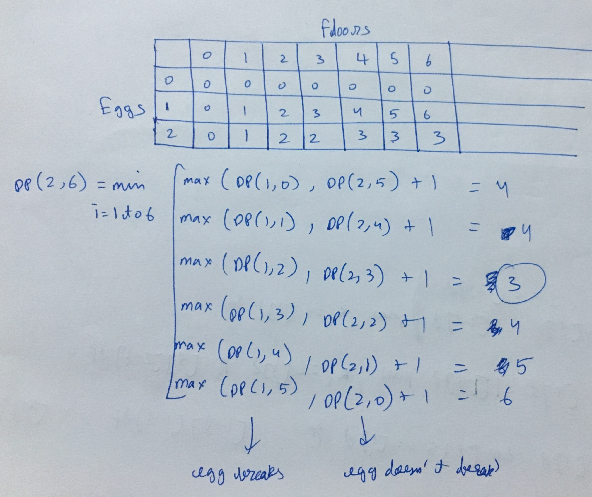
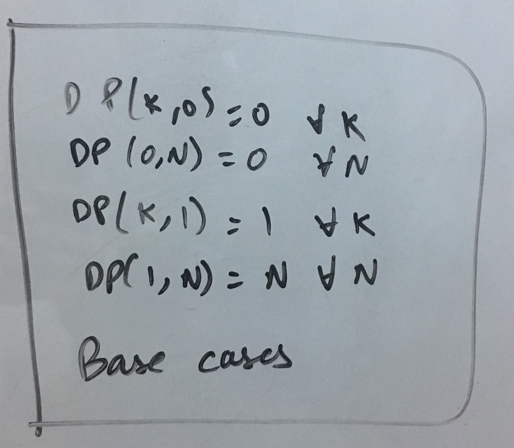

2 egg problem-
"divide building into sections, such that no matter which floor is correct, it always takes upto same number of attempts in worst case"
This idea automatically brings in the right balance/trade off
https://www.youtube.com/watch?v=NGtt7GJ1uiM

https://www.geeksforgeeks.org/puzzle-set-35-2-eggs-and-100-floors/
https://www.geeksforgeeks.org/egg-dropping-puzzle-with-2-eggs-and-k-floors/

Generalised problem-

To understand the base case, understand the following carefully-

"You know that there exists a floor F with 0 <= F <= N such that any egg dropped at a floor higher than F will break, and any egg dropped at or below floor F will not break."   
So existence of F is guaranteed
Suppose  K = 1, N = 2
Drop the egg from floor 1.  If it breaks, **we know with certainty that F = 0.**
Otherwise, drop the egg from floor 2.  If it breaks, we know with certainty that F = 1
**If it didn't break, then we know with certainty F = 2.**  
Hence, we needed 2 moves in the worst case to know what F is with certainty.

sol1.py- brute force recursive

sol2.py- recursive with memoization
written on my own but almost exactly same as -
https://github.com/bephrem1/backtobackswe/blob/master/Dynamic%20Programming%2C%20Recursion%2C%20%26%20Backtracking/eggDrop.java

sol3.py
bottom up DP
written on my own but almost exactly same as -
https://www.geeksforgeeks.org/egg-dropping-puzzle-dp-11/
https://www.youtube.com/watch?v=KVfxgpI3Tv0
https://github.com/bephrem1/backtobackswe/blob/master/Dynamic%20Programming%2C%20Recursion%2C%20%26%20Backtracking/eggDrop.java

"As an exercise, you may try modifying the above DP solution to print all intermediate floors (The floors used for minimum trial solution)."- easy to do. in sol3.py "min_steps=min(min_steps,max_steps)"-> open this into if-else loop. Update min_step_floor=m inside that if else loop. Print  min_step_floor next to "dp[i][j]=min_steps"

Other Solutions:
1.) Dynamic Programming with Binary Search
Time Complexity: O( totalEggs * ( totalFloors * log( totalFloors ) ) )
2.) Dynamic Programming with Optimality Criterion...whatever that is
Time Complexity: O( totalEggs * totalFloors )
3.) The Mathematical Approach...k
Time Complexity: O( totalEggs * log( totalFloors ) )

Future:
https://leetcode.com/problems/super-egg-drop/discuss/159508/easy-to-understand
