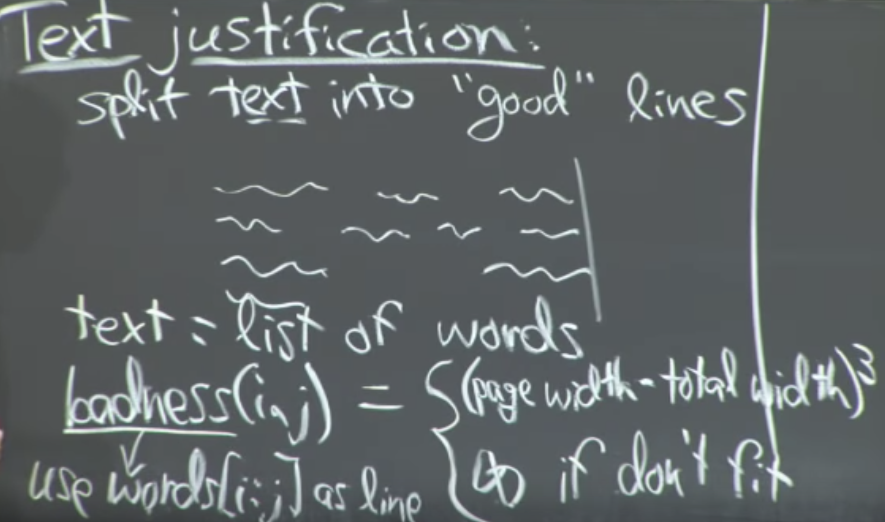
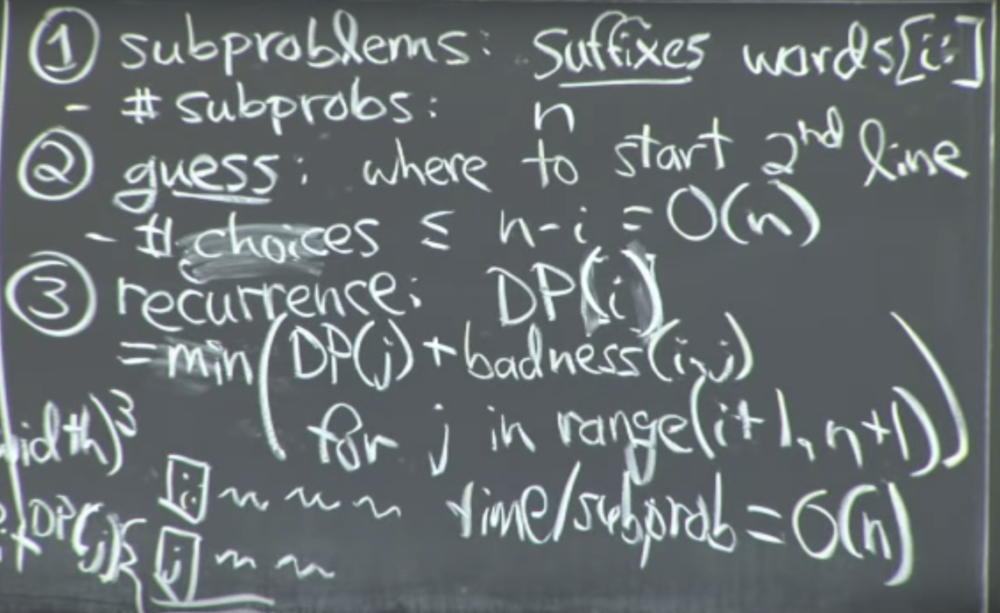
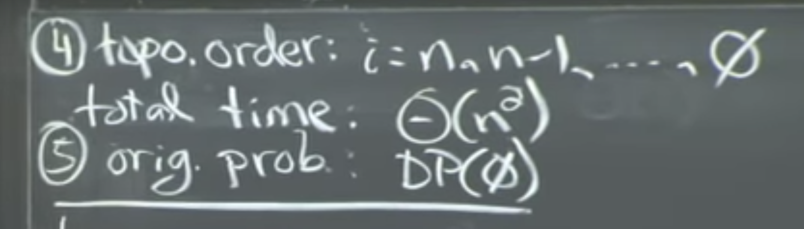
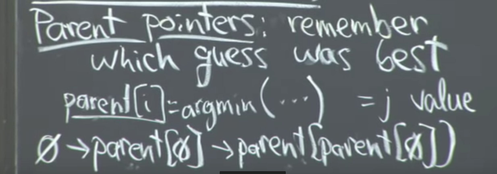

Greedy strategy is not optimal. (Pack as many in first line, then as many as in second line......)

Text= list of words

badness(i,j)= how bad it is to fit words[i:j] in a line

Want:
After i do the 1st guess, i have the problem of original type

DP(n)=0 (base case)

Parent pointer can be used on any DP. For this problem we can reconstruct the solution in O(n) time by calling the parent iteratively starting at 1st location
