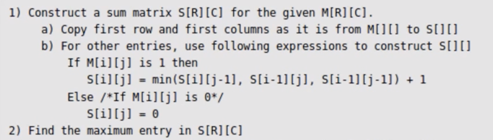

Similar problems

1. Square Submatrix. Largest Square of ones

Bottom up DP. Start from top left corner.
If Aux is aux matrix, Aux[i][j] gives the largest square ending at that coordinate.
Therefore, for top row and left most column, we could simply copy the original matrix into aux matrix. Complete algo-

sqaure.py and sqaure.cpp

Time and space- O(mn)

We can also do it in O(n) (where n is number of columns).Actually each time when we update aux[i][j], we only need aux[i-1][j-1], aux[i-1][j] (the previous row) and aux[i][j-1] (the current row). So we may just keep two rows.

optimized_sqaure1.py and optimized_sqaure1.cpp O(n) space

Future-
In addition, can be possibly downgraded even O(1) with 3 pointers to the current value of guys to my left, left-above, and above, if needed.

Reference-
https://leetcode.com/problems/maximal-square/discuss/61803/C%2B%2B-space-optimized-DP

2. Largest rectangle in histogram
a. Brute force. O(n^2). where n is number of bars
b. Divide and conquer. O(nlogn) time
c. Using stack. O(n) time
- push into stack if height is greater than top of stack. else pop till stack top is shorter than bar
- when we pop, find area for each bar popped (and calculate area based on it)
Space- O(n)- worst case size of stack
Invariant- each bar is pushed only once and popped only once. Hence O(n) time

3. Max Contiguous Subarray Sum. 1D (mcss)
https://www.youtube.com/watch?v=2MmGzdiKR9Y Back To Back SWE
https://www.youtube.com/watch?v=86CQq3pKSUw CS Dojo
https://leetcode.com/problems/maximum-subarray/ +similar questions
Brute force-
- O(N^3) or O(N^2) based on how you take sum
DP (Kadane)-
- O(N) time and O(N) space mcss_dp_O_n_space.py
- O(N) time and O(1) space mcss_dp.py

4. Max Subarray Sum (non contiguous). 1D

5. Max Sum Rectangular Submatrix in Matrix (2D version of #3). 2D kadane
https://www.youtube.com/watch?v=-FgseNO-6Gk Back To Back SWE
brute force- O(rows^2*cols^2)
kadane- O(rows*cols^2)
Keep a left pointer and right pointer. Maintain running row sums
msrsm.py
Accepted on -
https://practice.geeksforgeeks.org/problems/maximum-sum-rectangle/0#ExpectOP

ToDo-
https://www.quora.com/Given-an-array-of-integers-A-and-an-integer-k-find-a-subarray-that-contains-the-largest-sum-subject-to-a-constraint-that-the-sum-is-less-than-k
https://leetcode.com/problems/max-sum-of-rectangle-no-larger-than-k/
https://leetcode.com/problems/maximal-rectangle/
https://www.youtube.com/watch?v=g8bSdXCG-lA Maximum Size Rectangle of All 1's Dynamic Programming

6. Largest area of rectangle with permutations
laorwp.py
