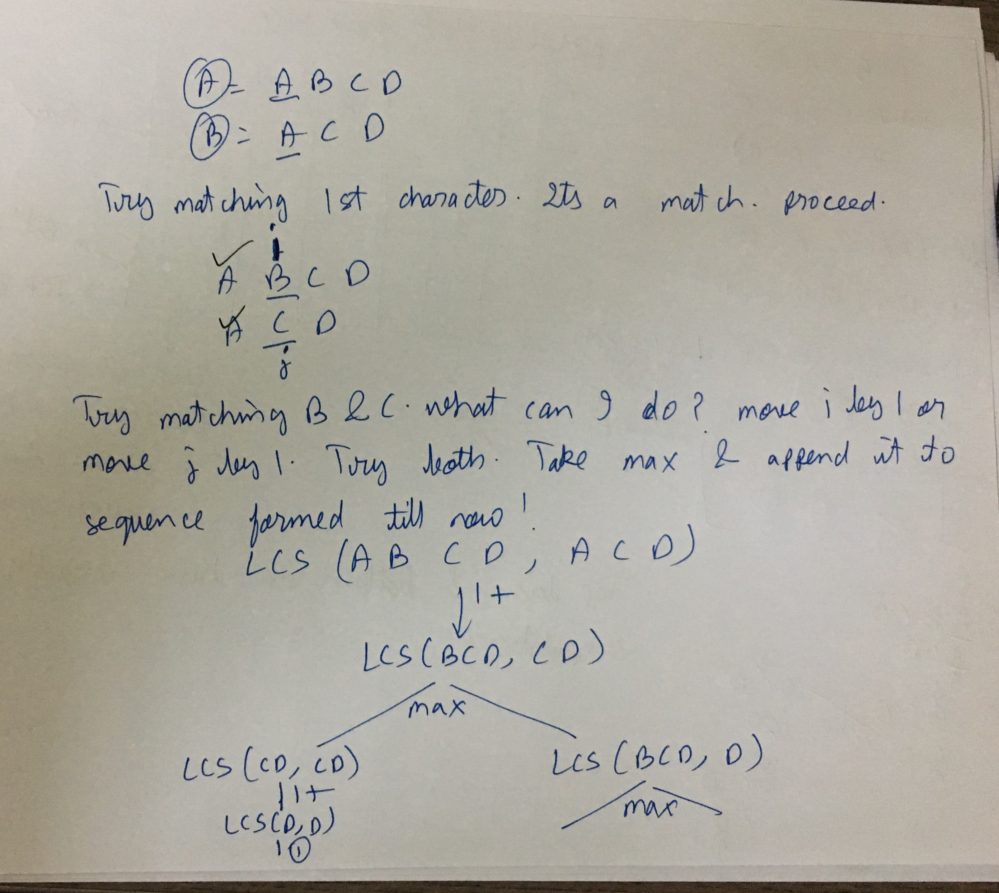
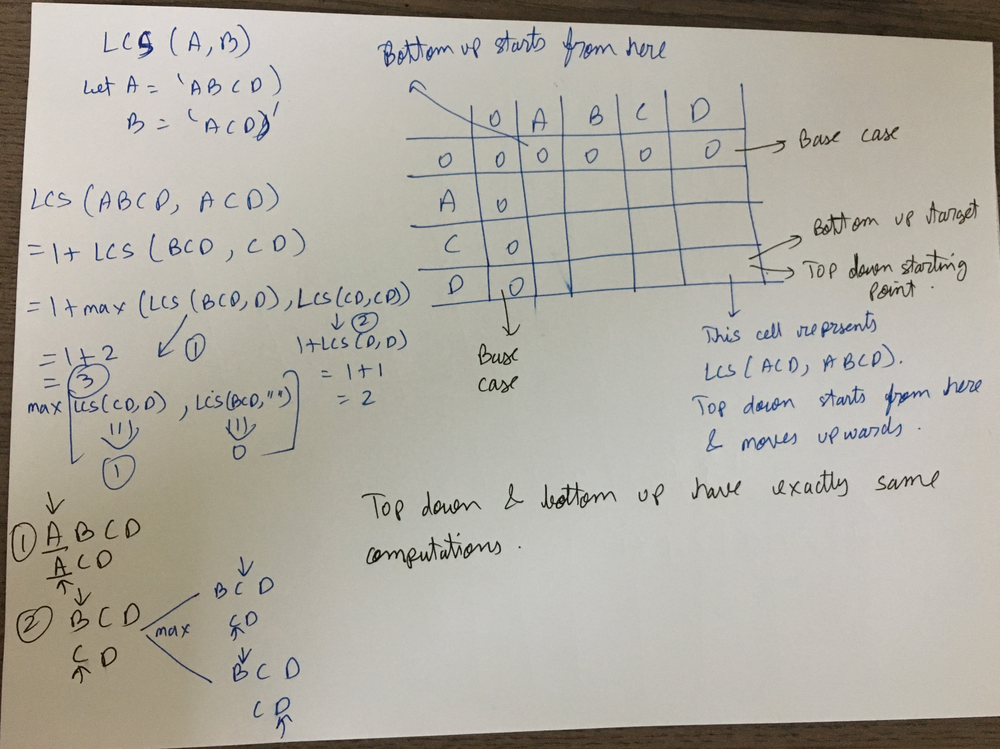

Thinking about Subproblem

recursion-

LCS(A,B,i,j)=
1. LCS(A,B,i+1,j+1) if A[i]==B[j]
2. max(LCSHelper(A,B,i,j+1),LCSHelper(A,B,i+1,j)) if A[i]!=B[j]
3. 0 base case. If i=len(A) or j=len(B)

There is a difference in "subsequence" and "substring". subsequence can have characters skipped

There can be more than 1 LCS

Problem: Print (all) LCS (if more than 1)

1. Use recursion only -> sol1.py. time seems O(pow(2,len(A)+len(B)))
2. Use recursion and memoization. top down
  - memo top down using dictionary
    - sol2.py. + printing all sequences
  - memo top down using 2D array
    - sol3.py + printing all sequences
  - time and space- O(len(A)* len(B))

3. bottom up DP
  - sol4.py  + printing all sequences
  - time and space- O(len(A)* len(B))

ToDo-
https://www.hackerrank.com/challenges/dynamic-programming-classics-the-longest-common-subsequence/problem

related
https://leetcode.com/problems/longest-palindromic-subsequence/
https://leetcode.com/problems/longest-palindromic-subsequence/discuss/99125/longest-common-subsequence-beats-94
https://leetcode.com/problems/delete-operation-for-two-strings/discuss/103214/Java-DP-Solution-(Longest-Common-Subsequence)
https://leetcode.com/problems/delete-operation-for-two-strings/discuss/103259/Longest-Common-Subsequence-DP-Java-Solution/188969/
https://www.geeksforgeeks.org/longest-common-subsequence-dp-4/

Good-
https://www.hackerrank.com/challenges/dynamic-programming-classics-the-longest-common-subsequence/editorial

IB link is hidden-
https://www.interviewbit.com/problems/longest-common-subsequence/

Learnings from IB-
Fully optimised memorised recursive solution faced stack error. Only way to get accepted was bottom up solution
