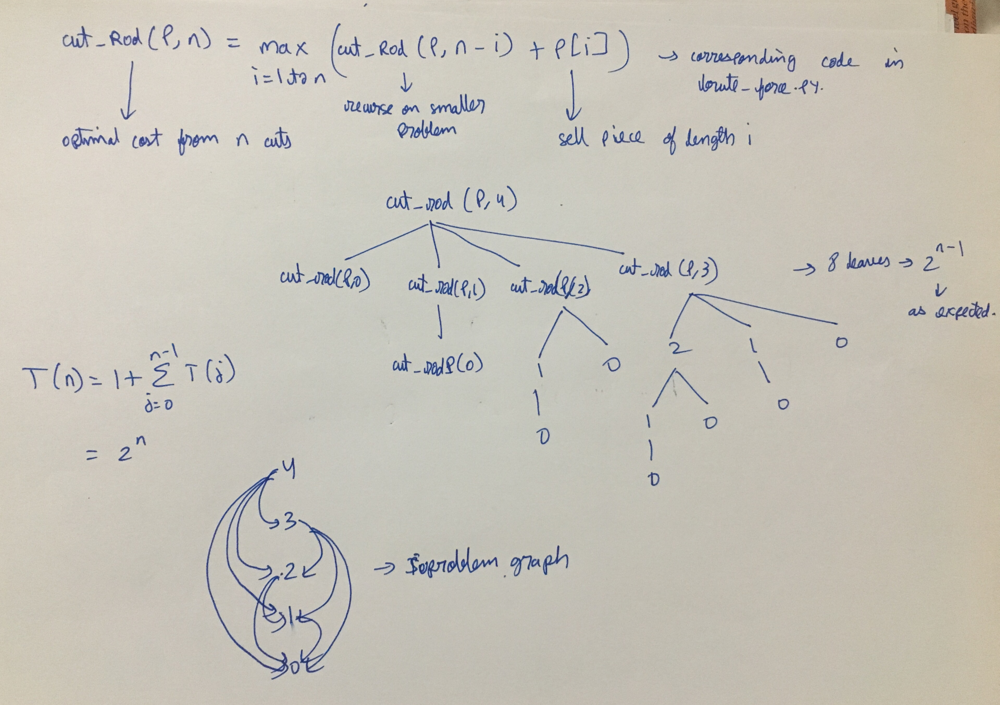

CLRS
1. Brute force. There are n-1 cuts possible. 2^(n-1) possible solutions.
Recurrence in pic1.jpg verifies the same (sanity check)
brute_force.py -> implements the recursion in pic1. (CLRS)

2. Top down DP. Simply add memo in brute force. O(n^2)

3. Bottom up. O(n^2). Also has getting the optimal cut

Via DP - O(n^2)

CLRS 15.1.3
in bottom_up.py->
optimal_val_at_i_cut=P[j]+R[i-j-1]-c*(i-j-1) as (i-j-1) signifies the number of cuts
in top_down.py->
optimal_val_at_i_cut=P[i]+self.cut_rod(P,n-i-1)-c*n-i-1

CLRS 15.1.4->
done for both bottom_up and top_down

Feels exactly like longest increasing subsequence. Especially because of brute_force/top down code. Check this hypothesis.

Bonus-
https://stackoverflow.com/questions/7781260/how-can-i-represent-an-infinite-number-in-python
