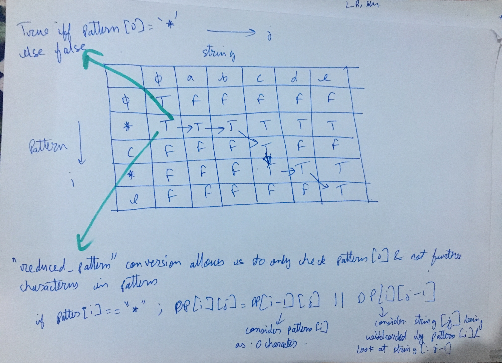
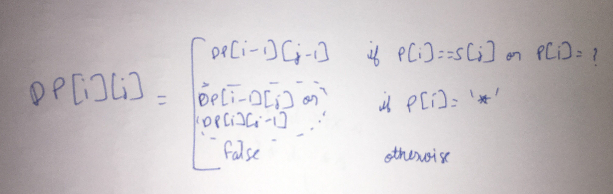

sol1.py-
recursive

sol2.py-     
bottom up    
https://www.youtube.com/watch?v=3ZDZ-N0EPV0
pattern is rows and input string is columns

A major trick that has lot of implication is to convert repeated \*\** to single *
For eg-
\*\*\*\*a\*\*\*b\*\*\**c*\*\* to \*a\*b\*c\*

Given this trick, now think of base case. (first row and first column of the DP table)

DP[0][0]=True   
If pattern is null, DP[0][j] is always False (j!=0)
If string is null, DP[i][0] is always False; apart from when reduced_pattern[0]='\*' in which case DP[1][0]=True. False for all other cases. (having reduced_pattern conversion helps here as well)

Rest is trivial

Just understand how the wildcard '\*' will work/match. Recursion will come automatically

