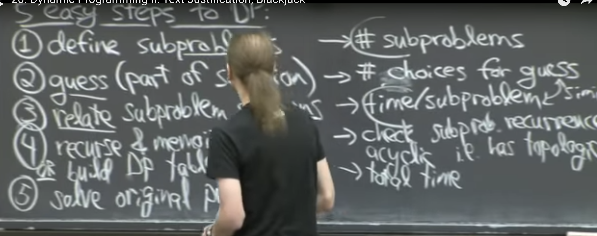
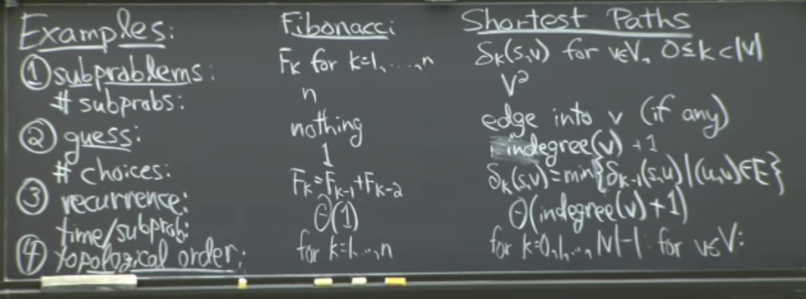
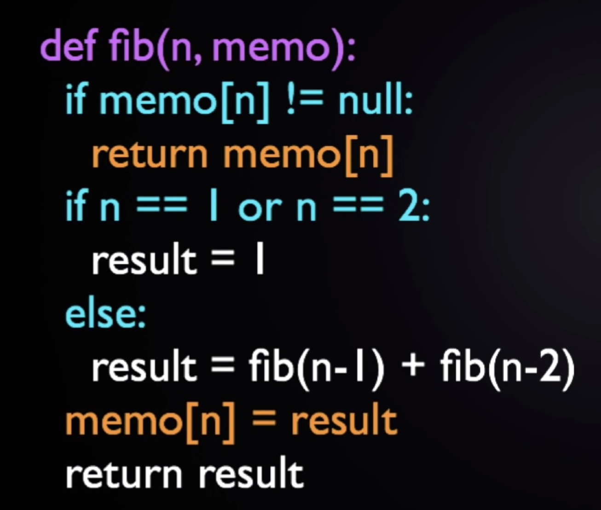
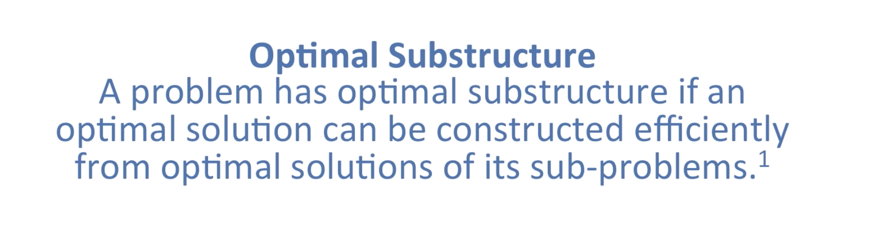

 Dynamic Programming is just a fancy way to say 'remembering stuff to save time later'

If the given problem can be broken up in to smaller sub-problems and these smaller subproblems are in turn divided in to still-smaller ones, and in this process, if you observe some overlapping subproblems, then its a big hint for DP. Also, the optimal solutions to the subproblems contribute to the optimal solution of the given problem

Imagine how the recursion tree computation simplifies as you go from naive recursion to recursion with memoization

Bottoms up DP tends to be exactly same as recursive DP (in terms of time yes. Exactly same computation/ observe this fact. is it so?. Maybe not be so in terms of space. Some optimization maybe possible in bottoms up )

Steps of DP (may not be in sequence always)

1. Define subproblems
2. Guess (part of solution)
3. Relate subproblem solutions (recurrence relation)
4. Build algorithm.
  * Recursion and memoization.
  * Or build DP table bottom up. (for loops). More practical (same running time in worst case)
5. Solve original problem. This might take some extra time sometimes

DP works really work when there is lot of repeated computation.

Advantage of bottoms up->
Dont need to worry about stack overflow on recursions

Use proofs like induction to determine optimal substructure when using DP. Problems no having optimal substructure cannot be solved via DP

Problems not showing optimal substructure-
* Given a regular polygon, find the longest path between 2 given vertices

* Maximal Clique Problem -
clique-> group of points in a graph all connected to each other
Maximal clique-> a clique with most points in a graph

max sum subarray is Kadane. And max product is DP? Any relation in them?

Google Subset Sum Problem Dynamic Programming. "Equal Average Partition" is based on it. (or builds on top of it)

Longest Common Subsequence (Dynamic Programming)

The  advantage of top-down is that sometimes it is easier to write, since answering the question “what information do I need to compute the answer for this subproblem” can be easier than “what order should I compute the answers for the subproblems in such that when I get to a subproblem, I have already computed all the information I need”.

Why is recursion used so commonly in software engineering interview questions at software companies like Google, Facebook, and Amazon, but is so rarely used in real work?
https://qr.ae/TWh5OK
