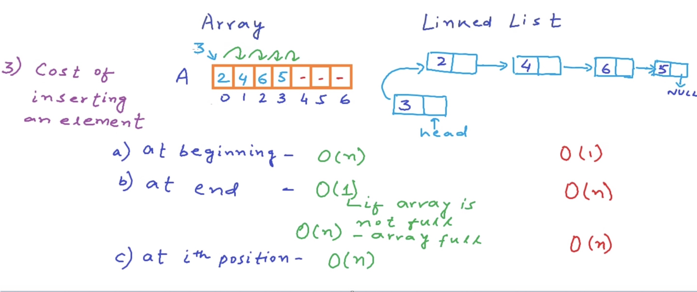
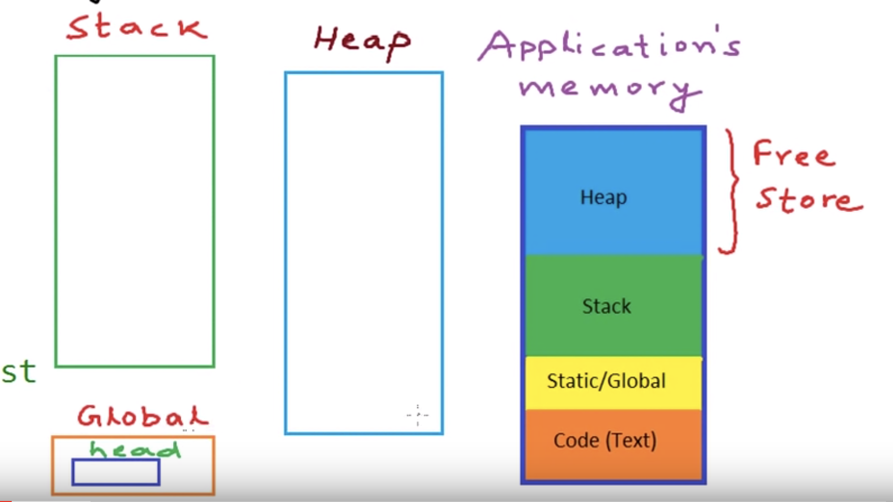

No such thing as perfect DS. Depends on most frequent operation required.

Array- constant time access
LL- Linear time access

LL- only need address of head node to know the entire LL

To pass a LL to a function, just pass the address of the head node

Arrays are allocated memory blocks. LL are more flexible, and take size only equal to number of nodes in LL.
As arrays are contiguous blocks, we may never see a huge contiguous block of memory. But LL are flxible, and can be stored in multiple small chunks of memory

No unused memory in LL.

Imagine a data type of 4 bytes. Array of size 5 will take 20 bytes (whether array is empty or full)

LL node of same data type will take 8 bytes. (assuming pointer variable also takes 4 bytes). If LL has 3 nodes, it will take 24 bytes (+4 bytes if you consider head of LL; which is pointer to the LL)

LL is very helpful if data type is complex and takes larger memory per element

LL preferred if data is dynamic. Need lot of insertions, deletions

Cost of deletion is same as insertion

Arrays are easier to use than LL

 The entry point into a linked list is called the head of the list. It should be noted that head is not a separate node, but the reference to the first node. If the list is empty then the head is a null reference.

Memory picture of a program-

Node* temp=new Node();  OR malloc
Creates variables in heap section of memory. These variables stay in program even if the function that created them completes. If we had local variables, they would have been lost when function ended. And the LL nodes would have been cleaned/deleted. Heap stays in memory unless explicitly deleted
