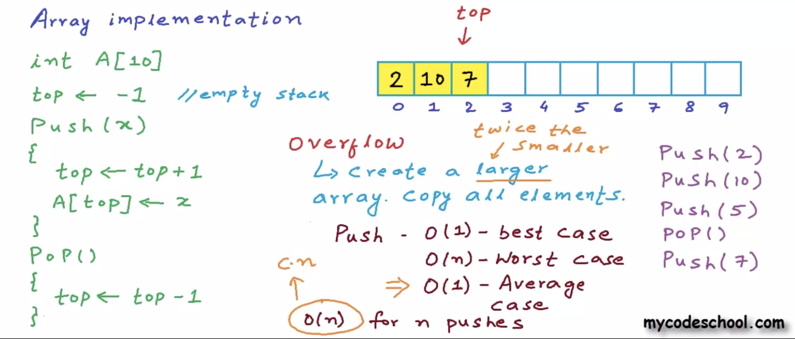
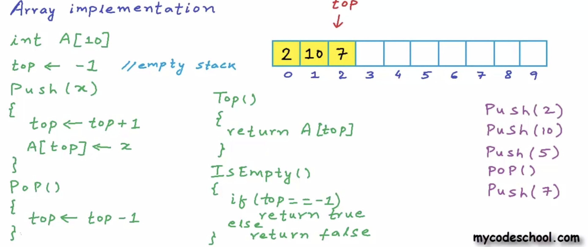

Applications of stack-
1. Function call/recursion
2. Undo in editor
3. Balanced parentheses (source code; compiler check)

To implement stack using list, we only need to enforce LIFO structure
Can be done via LL or arrays

In array implementation, to handle overflow, copy contents from original array to new array of twice the size. O(n) time where n is contents in stack (elements copied)

If we start with an array of size 1 and keep doubling the size with each overflow, for n pushes.. cost of copy will be

 (1 + 2 + 4 + 8 + ... + n/2 + n)
 = n * ( 1+ 1/2 + 1/4 + 1/8 + ... 1/n)  -  taking out n
= n*2   - the expression in bracket above will evaluate to 2.

So, cost of copy in n pushes = O(n)
Cost of n normal pushes = O(n)  - each push takes constant time
Total cost of n pushes = O(n)
Average cost of 1 push = O(1).

Code in C++-
https://gist.github.com/mycodeschool/6878628

Code in C-
https://gist.github.com/mycodeschool/6878252

All languages-
https://www.interviewbit.com/tutorial/stack-implementation-details/

In LL implementation, we add/remove from head of LL. Takes O(1) time. LL implementation has advantage that overflow never occurs (unlike array)
