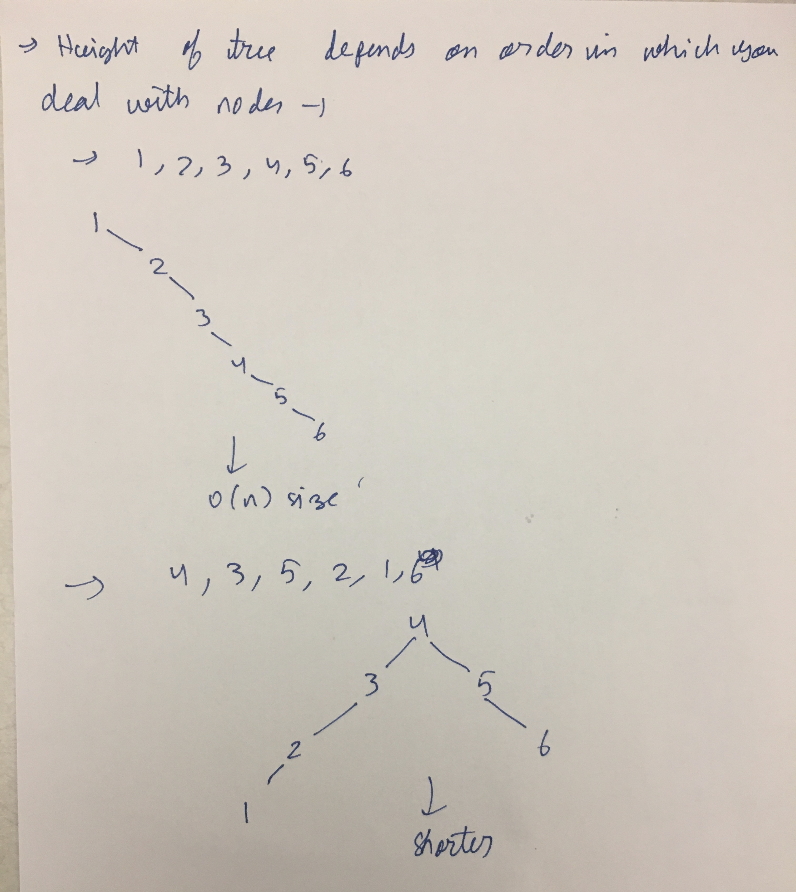

* Go through ./MIT6_006F11_lec05.pdf
* 
* 
* 
* To Do-
  - [ ] CLRS 12
  - [ ] https://ocw.mit.edu/courses/electrical-engineering-and-computer-science/6-006-introduction-to-algorithms-fall-2011/readings/binary-search-trees/
  - [ ] Stuff below
* BST- dynamic version of sorted array
* Types of balanced BST's-
  * Red black
  * AVL trees
  * Splay trees
  * B/B+ trees
* You can always augment BST to support operations/conditions you want
* Take note how "insert"/"delete" in BST modify the values in augmented DS
  * One way to insert is-
    * One pass- try to insert.
    * Second pass- if insert is possible, actually updated augmented data and also insert
    * Single pass insert possible. Maybe via recursion. Try to think how
* start tree-min/tree-max from root of the subtree where you want to call them
- [ ] Leetcode questions
- [ ] CLRS Ch 10
