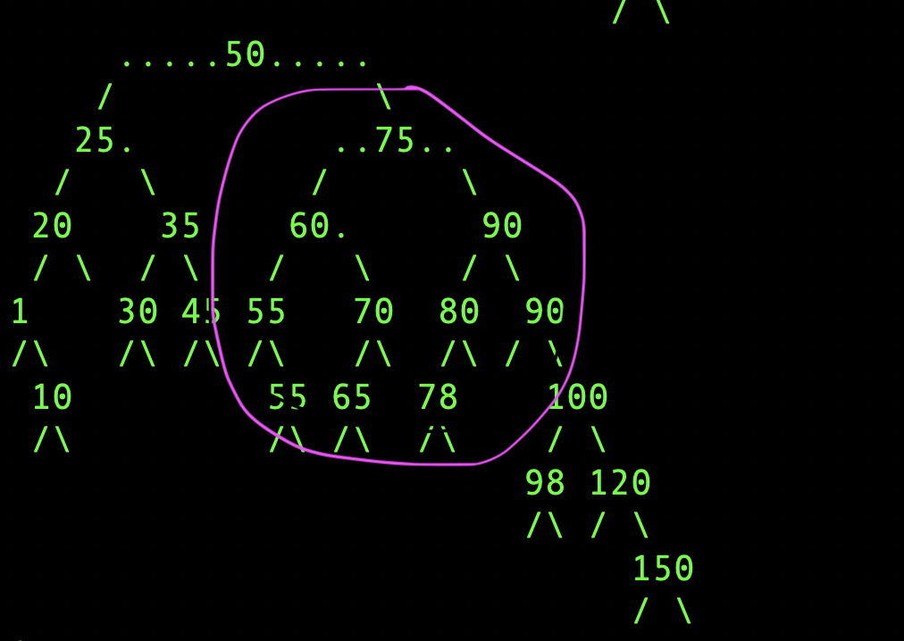

* Consider above BST
* First of all, predecessor/successor of leaves will always be found search "up"
* BST has this subtree property-
  * Everything on the left subtree is <= the node.key; and everything on the right subtree is >= the node.key
  * To find successor, it is natural (and correct) to think successor is smallest node on right subtree
  * But we also have candidate 2- in case right subtree is empty, we search in the above "parent" nodes; and see when it first turns right.
  * What is the guarantee that candidate 1 is always better than candidate 2 (assuming children exist)
    * This is implicit and guaranteed by BST structure
    * Consider the node "70". Imagine if 70 had a right child. What could that right child values be? ONLY 71-74 (avoiding case of 70,75). These are exactly the values between our node (70), and possible candidate 2. The entire subtree on right child of 70 (possible candidates 1) will always be better candidates than candidate 2. If no candidate 1 exists, candidate 2 naturally becomes the only successor option.
